#  Almouraq Supermarket Platform (Eecommerce System)🛒

<p >

</p>

---

<p align="center">


</p>

---

# 🌍 Live Demo

<p align="center">

<a href="https://almouraq.store">

</a>

<a href="https://play.google.com/store/apps/details?id=com.alsayedtech.almouraq&pcampaignid=web_share">

</a>

</p>

---

# 📌 Overview

**Almouraq Supermarket Platform** is a **complete supermarket ordering system** developed as a **freelance project for a real client**.

The system is currently **live in production** and actively used by customers to browse products, add items to cart, and place orders online.

The platform was designed as a **multi-platform system** that includes:

- 📱 **Android Mobile Application**
- 🌐 **Web Application built with React**
- 💻 **Admin Dashboard for store management**

The system is hosted on a **live production server**, enabling real-time product updates and order processing.

---

# ⚠ Project Notice

This repository is a **portfolio showcase only**.

The **source code is private** because the project was developed for a **real client as a freelance project**.

This repository exists to demonstrate:

- Project architecture
- System features
- Technology stack
- Screenshots of the production system

---

# 🏗 System Architecture

```
Customers
   │
   ├── Android App
   │
   └── React Web App
           │
           ▼
       REST API (PHP)
           │
           ▼
        MySQL Database
           │
           ▼
     Admin Dashboard
```

---

# 🛠 Tech Stack

## Mobile Application
- Android Studio
- Java
- RecyclerView
- Volley (API communication)
- Glide (Image loading)

## Web Application
- React.js
- JavaScript
- Responsive UI

## Backend
- PHP REST API
- JSON API responses
- Server-side validation

## Database
- MySQL relational database

## UI / UX
- Figma design prototypes
- Mobile-first interface

---

# 🚀 Core Features

## Shopping System

- Browse supermarket products
- Search products instantly
- Filter by categories and brands
- Product offers and discounts
- Favorites system
- Shopping cart
- Dynamic quantity updates
- Real-time total price calculation

---

## Order System

- Checkout form
- Delivery information
- Order confirmation
- Order summary
- Delivery notes

---

## Admin Dashboard

- Manage products
- Manage categories
- Manage brands
- Manage offers
- View and manage orders
- Upload product images

---

# 🖼 System Screenshots

## Mobile Application

<p align="center">
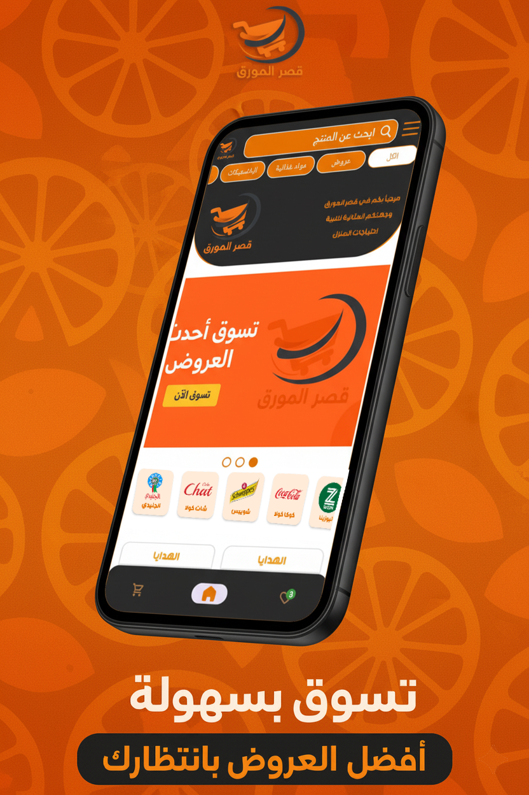
   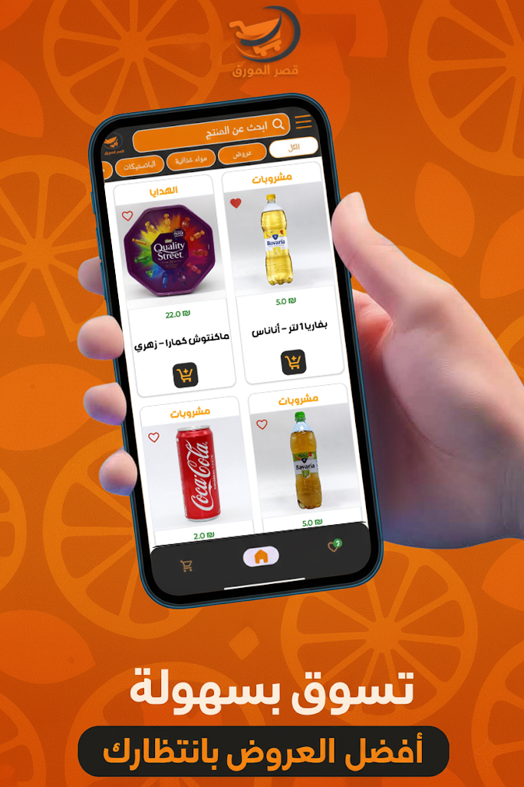
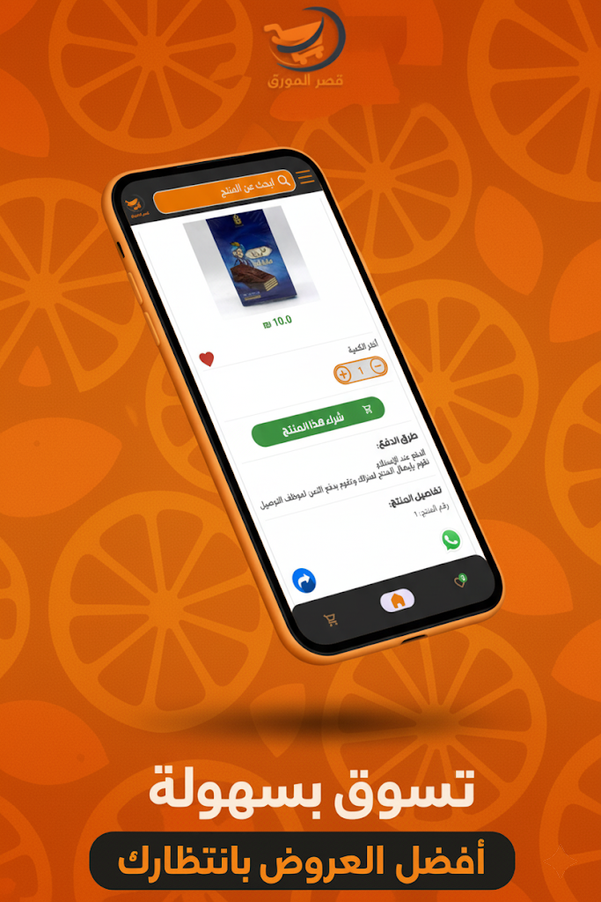
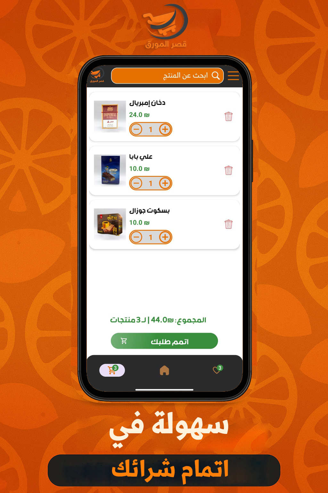
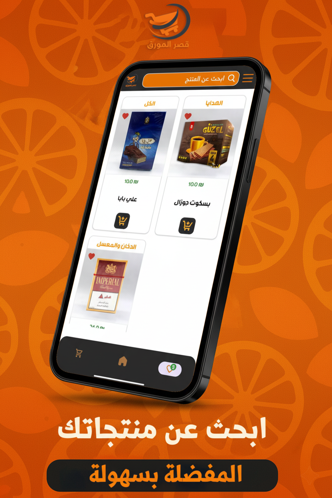
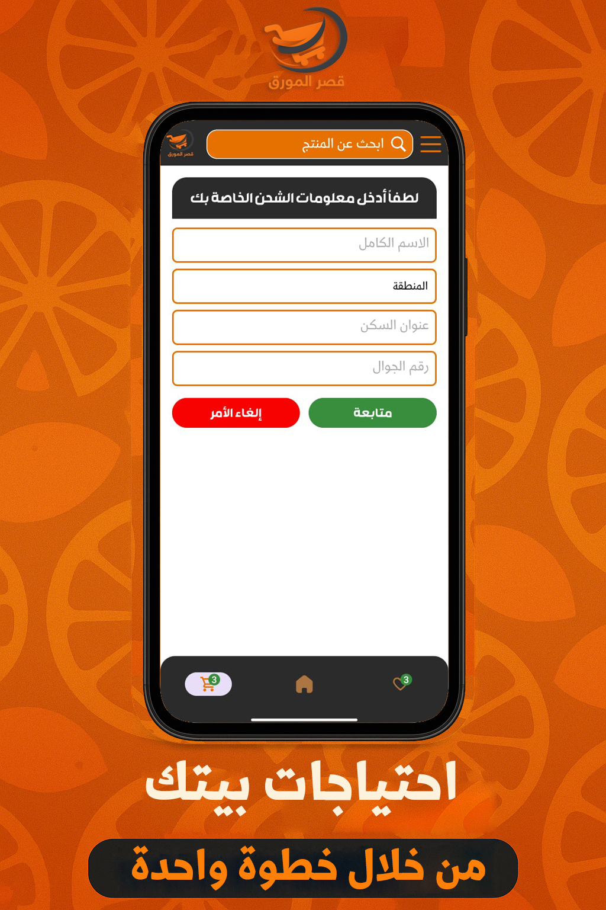
</p>

---

## Web Application

<p align="center">
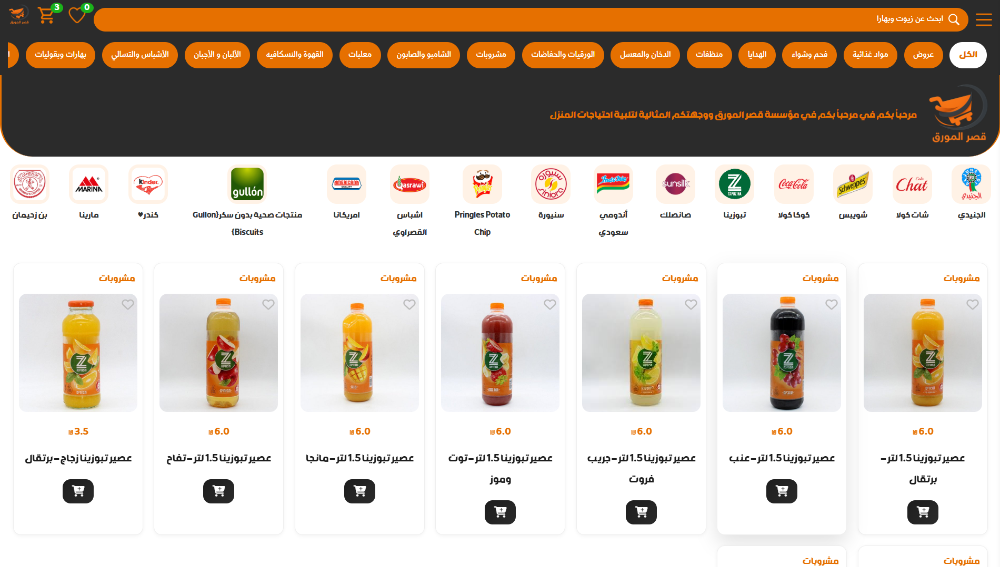
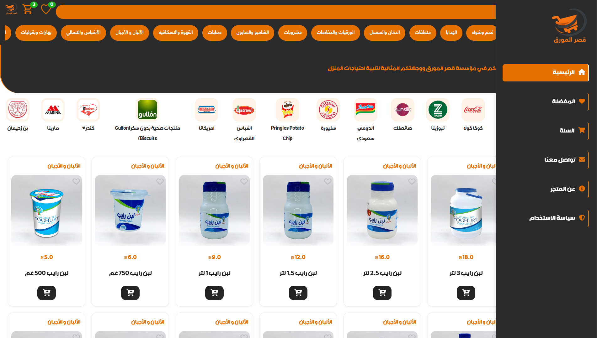
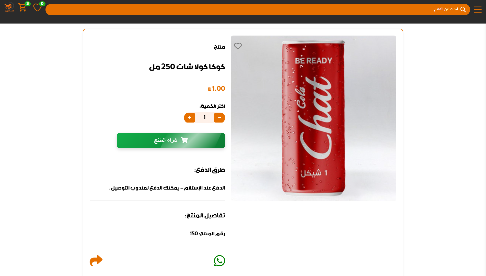
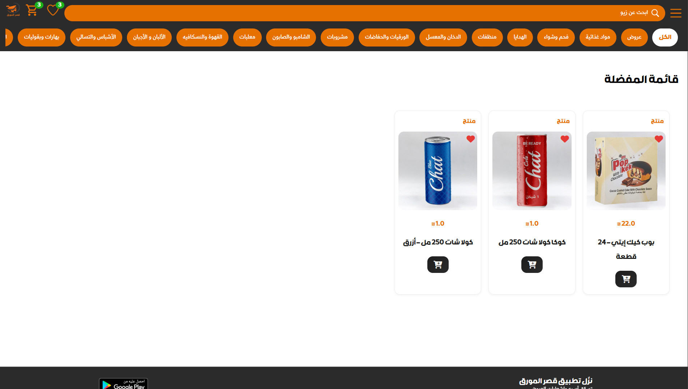
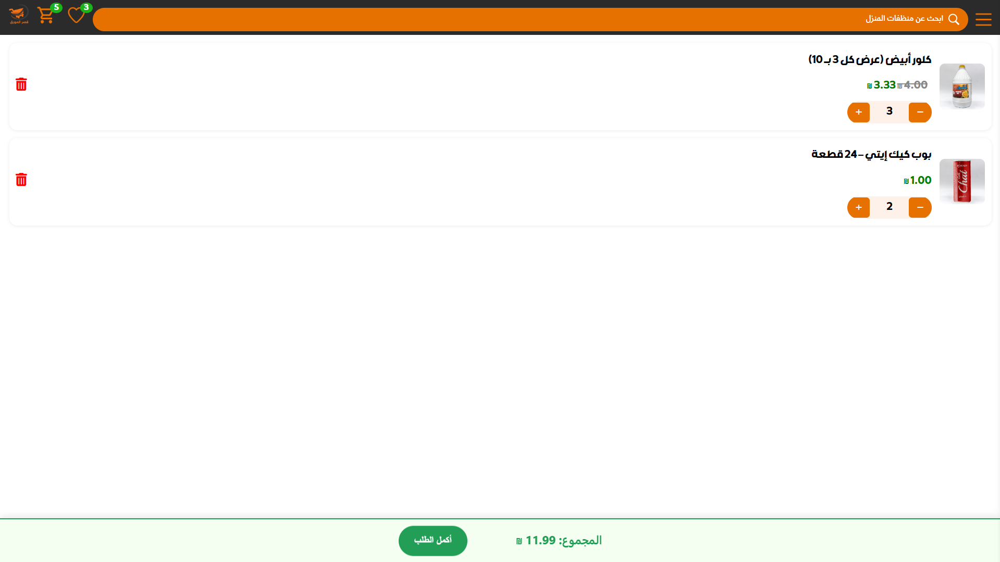
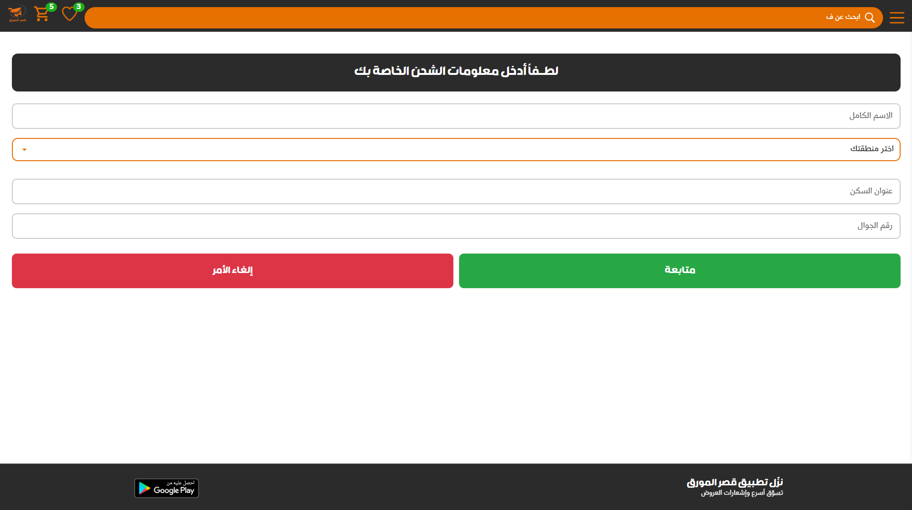
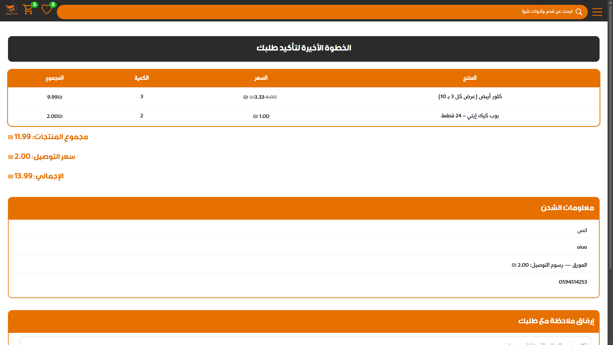
</p>

---

## Admin Dashboard

<p align="center">
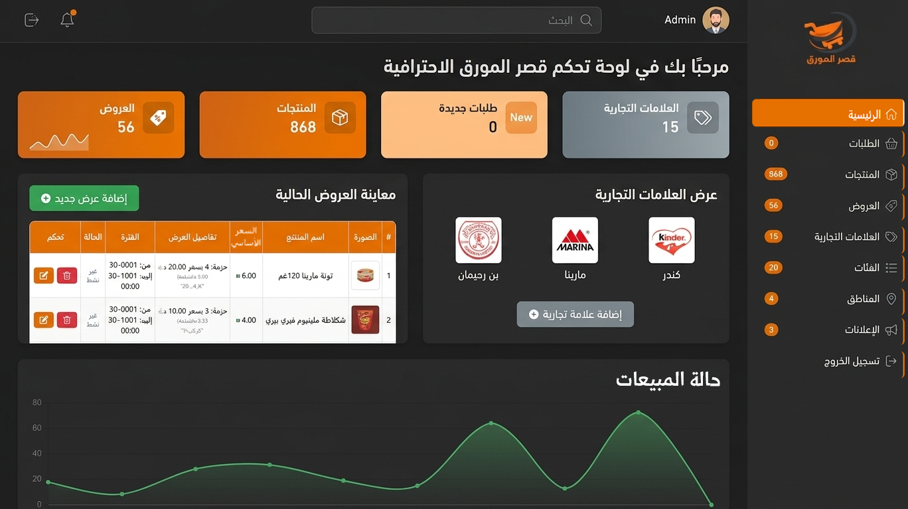
</p>

---

# 🎥 Android App Live Demo

You can watch a **live demonstration of the Android application** showcasing the full user experience including:

- Browsing products
- Viewing offers
- Adding items to cart
- Checkout and order confirmation

<p align="center">

<a href="https://drive.google.com/file/d/1HBn1nXJbiCLaCpgWF3377IU1Hopsiika/view?usp=sharing">
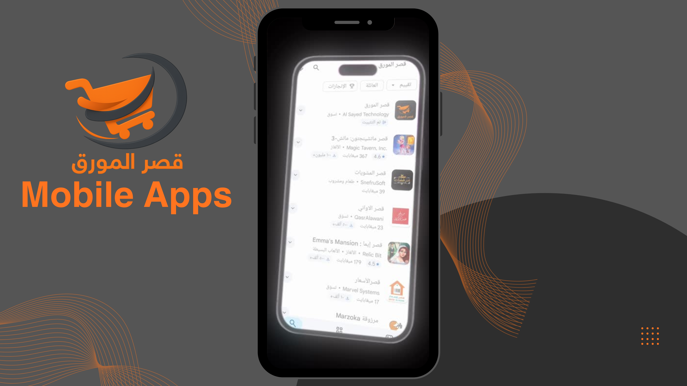
</a>

</p>

📺 **Watch the full demo video here:**

PUT_VIDEO_LINK_HERE

---
# 📊 Project Highlights

✔ Production system  
✔ Real client freelance project  
✔ Multi-platform architecture  
✔ Live web and mobile applications  
✔ Custom backend API  
✔ Admin management dashboard  

---

# 👨‍💻 Author

Developed by **Anas Al Sayed**

Freelance Software Engineer
